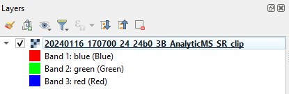
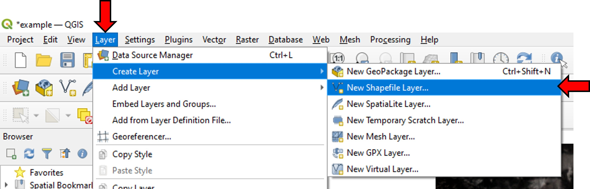
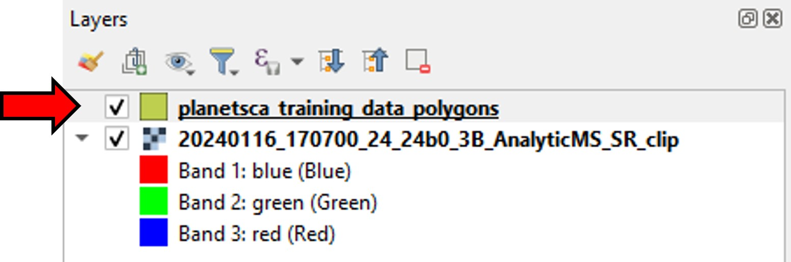
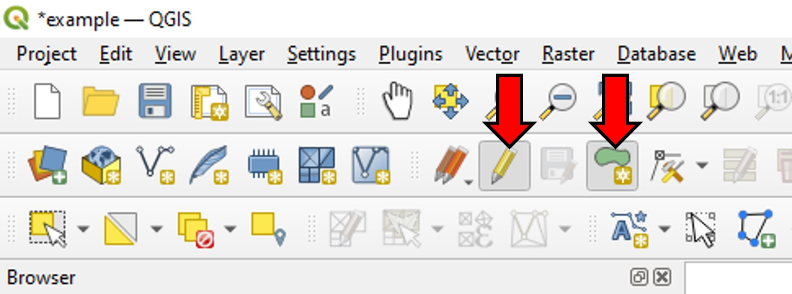
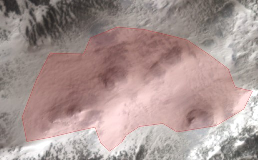
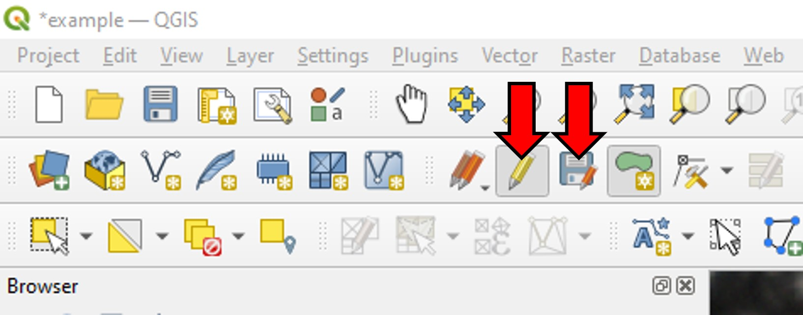
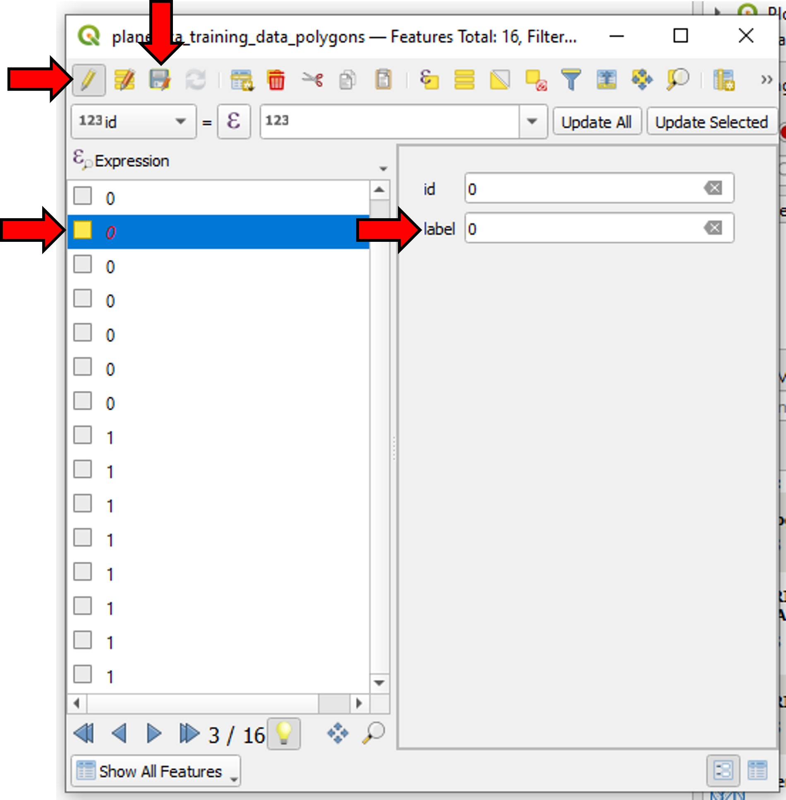

Creating Training Data
=====================================================

Introduction
------------

The following instructions describe the steps to create a training data set for a Planet Snow Covered Area (SCA) random forest classifier model. This example will use `QGIS <https://qgis.org/>`_, an open-source geographic information system (GIS) desktop application, but similar steps can be taken in proprietary software like ArcGIS to accomplish the same things.

To create a training data set, we will need access to at least one Planet Scope image where snow is present on the landscape, representative of the region we’d like to map SCA in. We will create a geojson or shapefile (a collection of polygons) outlining areas of snow (labeled ``1``) and areas without snow (labeled ``0``) that we can visually identify.

After creating this file, we will use the training module of the planetsca library to create the final training dataset, with which we can train a new random forest classifier model to detect snow in Planet Scope images.

Select a sample Planet Scope image
----------------------------------

You will need a sample Planet Scope image to create a training data set. You can use the search and download functions of planetsca to retrieve an image you'd like to use. In a new QGIS project, import this image by going to the *Layer* menu, then *Add Layer*, and *Add Raster Layer* (alternatively you can drag and drop the file into the Layers panel).

Here is what that image might look like (this image is ``20240116_170700_24_24b0_3B_AnalyticMS_SR_clip.tif``):

.. image:: doc_images/training_data_1.jpg
    :alt: Example Planet Scope RGB image
    :width: 400px
    :align: center

This image is displayed as a "Multiband color" image, showing the red, green, and blue bands.

We could also visualize the fourth, near-infrared (NIR) band as well.

.. image:: doc_images/training_data_3.jpg
    :alt: Example Planet Scope images
    :width: 600px
    :align: center

Create new shapefile layer
--------------------------

We will use polygons (in a shapefile layer) to outline areas of snow or no snow in our sample image.

In the *Layer* menu, go to *Create Layer*, then *New Shapefile Layer*.

In the window that opens up, give this layer a *file name* (and choose where to save the file). Set the *geometry type* to ``Polygon``. Under *New Field*, create a new field with the *name* ``label``, and *type* ``Integer``, then click *Add to Fields List* and then *OK*.

.. image:: doc_images/training_data_5.jpg
    :alt: New Shapefile Layer options
    :width: 400px
    :align: center

You will see your new layer show up in the Layers panel.

Label the training dataset
--------------------------

To begin the process of outlining areas of snow or no snow in the sample image, select the shapefile layer in the layers panel, click on the pencil icon in the top menu bar to *toggle editing*, then click on the shape icon to *add polygon feature*.

Now you can draw a polygon by left-clicking on the sample Planet Scope image. Each time you left-click you will create a new vertex for your polygon. Draw a polygon around an area of open snow that you can visually identify.

When you have finished drawing the outline, right-click to stop drawing. This will open a *Features Attributes* window. In the *label* field, enter the value ``1`` to label this polygon as outlining an area with snow.

.. image:: doc_images/training_data_9.jpg
    :alt: Feature Attributes for snow
    :width: 400px
    :align: center

Click on the same shape icon to *add polygon feature* again. This time, outline an area without snow, and set the *label* field to ``0``.

.. image:: doc_images/training_data_10.jpg
    :alt: Feature Attributes for no snow
    :width: 400px
    :align: center

Repeat for as many snow and no snow areas as you think you'll need. The blue, green, red, and NIR band reflectance values for all pixels within each polygon will be used as training data for the model.

When you are finished, you can click the *save layer edits* icon (save disk icon with small red pencil), then click the yellow pencil icon to turn off *toggle editing* for this layer.

You might have something that looks like this now on the map:

.. image:: doc_images/training_data_12.jpg
    :alt: Example map with polygons
    :width: 400px
    :align: center

To visualize which polygons are labeled ``0`` for snow and ``1`` for no snow, right click on the shapefile layer in the layers panel, then click *Properties*.

Under *Symbology* change the symbol type from ``Single Symbol`` to ``Categorized``. For *value*, select the ``label`` field. Then click *classify* to automatically assign some colors to each label value. Click *apply* and *OK* to accept these changes and close the properties window.

.. image:: doc_images/training_data_13.jpg
    :alt: shapefile layer symbology options
    :width: 400px
    :align: center

Your map might look something like this now:

.. image:: doc_images/training_data_14.jpg
    :alt: Example map with colored polygons
    :width: 400px
    :align: center

If you need to edit the polygons' labels, you can right-click on your shapefile layer in the layers panel, and click *Open Attribute Table*. Here you can click the yellow pencil icon to toggle editing, select an individual polygon, and edit its label field. Be sure to click the save icon in this window after making any changes that you wish to keep.

Export the labeled polygons
---------------------------

Right click on the shapefile layer in the layers panel, and click *Export* then *Save Features As*. Save this as a ``GeoJSON`` format and make sure that the ``label`` field checkbox selected. Click *OK* to export this to a file.

.. image:: doc_images/training_data_16.jpg
    :alt: Export to GeoJSON file
    :width: 400px
    :align: center

Create training data with planetsca
-----------------------------------

Finally, you can use the planetsca library to create the training data.

.. code-block::

    # import the planetsca train module
    from planetsca import train

    # provide filepaths to geojson and sample Planet Scope image
    labeled_polygons_filepath = "./example_training_data/planetsca_training_data_polygons.geojson"
    training_image_filepath = "./example_training_data/20240116_170700_24_24b0_3B_AnalyticMS_SR_clip.tif"

    # create the training data, also save it to a csv file
    training_data_df = train.data_training_new(
        labeled_polygons_filepath,
        training_image_filepath,
        training_data_filepath="./example_training_data/example_training_data.csv",
    )

    # preview what the resulting dataframe looks like
    training_data_df.head()

You’re now ready to move on to train a new model and then make predictions!

Other resources
---------------

* `QGIS Tutorials <https://www.qgistutorials.com/en/>`_
